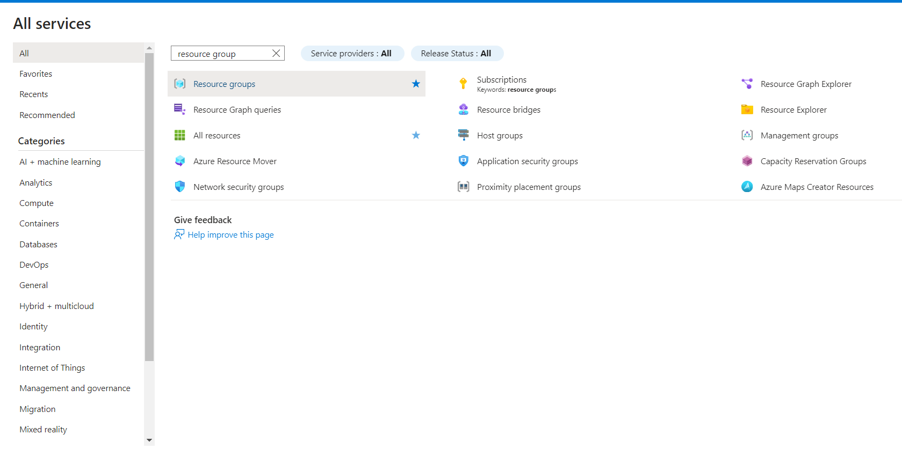

# Azure Synapse Analytics

Azure Synapse is a limitless analytics service that brings together data integration, enterprise data warehousing, and Big Data analytics.

It gives you the freedom to query data on your terms, using either serverless or dedicated resources-at scale. Azure Synapse brings these worlds together with a unified experience to ingest, explore, prepare, manage, and serve data for immediate BI and machine learning needs.

Key service capabilities include:

* Unified analytics platform
* Serverless and dedicated options
* Enterprise data warehouse
* Data lake exploration
* Code-free hybrid data integration
* Deeply integrated Apache Spark and SQL engines
* Cloud-native HTAP
* Choice of language (T-SQL, Python, Scala, SparkSQL, & .NET)
* Integrated AI and BI

<figure><figcaption></figcaption></figure>

<figure><figcaption></figcaption></figure>

<figure><figcaption></figcaption></figure>

<figure><figcaption></figcaption></figure>

<figure><figcaption></figcaption></figure>

<figure><figcaption></figcaption></figure>

<figure><figcaption></figcaption></figure>

<figure><figcaption></figcaption></figure>

<figure><figcaption></figcaption></figure>

<figure><figcaption></figcaption></figure>

<figure><figcaption></figcaption></figure>

<figure><figcaption></figcaption></figure>

<figure><figcaption></figcaption></figure>

<figure><figcaption></figcaption></figure>
